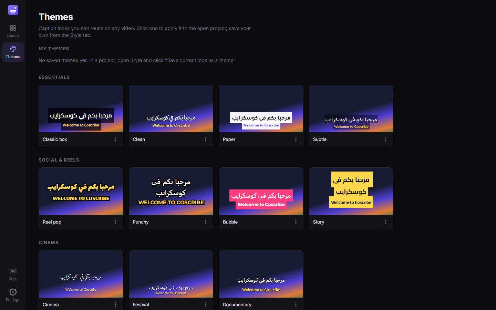

# COSCRIBE

**The local video translation app** — by Youssef Nidam.

Drop a video. Coscribe listens, writes the captions, translates them, lets you style them, and burns them into the video. Everything runs on your own computer: no uploads, no accounts, no subscriptions.



## Languages

| | Captions (speech → text) | Translation | Interface |
|---|---|---|---|
| **Arabic** | ✅ | ✅ | ✅ (right-to-left) |
| **English** | ✅ | ✅ | ✅ |
| **French** | ✅ | ✅ | ✅ |
| **Amazigh (Tifinagh)** | — | ✅ beta | — |
| Moroccan Darija | — | ⚠️ experimental | — |
| + 18 more (Spanish, German, Turkish, Chinese, …) | ✅ | ✅ | — |

- **Amazigh** uses NLLB-200 3.3B in Central Atlas Tamazight (`tzm_Tfng`), the base of standard Moroccan Amazigh, rendered with Noto Sans Tifinagh. It's the only local model that writes usable Tifinagh. Always proofread it.
- **Darija** uses Atlas-Chat 9B (MBZUAI-Paris). It sounds more natural than general models, but meaning can drift. Sentences whose numbers change are automatically redone with TranslateGemma.

## Features

- **Project library**: thumbnails, search, filters (in progress / translated / exported), sorting, rename, duplicate, delete. Drop a video anywhere in the app to start a project.
- **Import from a link**: paste a YouTube link (or any site [yt-dlp](https://github.com/yt-dlp/yt-dlp) supports) in the Library, pick a language, and Coscribe downloads the video (up to 1080p), transcribes it and translates it in one go. Single videos only, no playlists, live streams or private videos. Only download videos you have the right to use.
- **Accurate transcription**: Whisper large-v3 on the GPU, with accuracy-first decoding and word-level timing.
- **Two translation qualities**: *Best* (Google TranslateGemma 12B) and *Fast* (Meta NLLB-200 600M). Whole sentences are translated together, then split back across the captions at natural pauses.
- **Caption editor**: edit any line, split at the cursor, merge, delete, add captions at the playhead, set start/end timing (`[` `]`), find & replace, undo/redo.
- **Themes collection**: 16 built-in caption looks in 5 categories (Essentials, Social & Reels, Cinema, Arabic calligraphy, Bold). Save your own, and set a default theme for new projects.
- **Full styling**: 13 fonts (8 with Arabic), size, bold, uppercase, colors, box / outline / shadow, position, bilingual two-line captions.
- **What you see is what you export**: the preview uses the same font files and the same sizing maths as the renderer.
- **Export**: MP4 with burned-in captions at the original size, 1080p or 720p, plus `.srt` / WebVTT files. You can cancel a running job, and the app shows the time remaining.
- **Interface** in English, French and Arabic, dark / light / system appearance, keyboard shortcuts (`?`).

## Download & install (Windows)

**[⬇ Download CoscribeSetup.exe](https://github.com/yfnidam72/COSCRIBE/releases/latest/download/CoscribeSetup.exe)** — run it and click **Install**.

The installer is small (~11 MB). It downloads everything else into your user folder, so it needs **no admin rights**:
- Python 3.11 and the app's components (via [uv](https://github.com/astral-sh/uv))
- Coscribe itself (latest release from this repo)
- a private copy of FFmpeg
- *optional* Ollama (needed for *Best* translation and Darija)
- *optional* the speech model (Whisper large-v3, 3.1 GB)

It then adds Coscribe to the Start menu and Desktop, and registers an uninstaller in *Settings → Apps*.

> Windows SmartScreen may warn that the installer is from an unknown publisher (it isn't code-signed yet). Click **More info → Run anyway**.

**Requirements:** Windows 10/11, ~6 GB for the app and speech model, plus the translation models you choose (below). An NVIDIA GPU with 6–8 GB of VRAM makes it much faster. Without one, choose *Whisper small* on the Models page.

**Your videos** are saved to **`Videos\Coscribe`** (created automatically). You can change it in *Settings → Export folder*.

### Models

Open the **Models** page in the app to download, switch or remove models. Everything runs offline once downloaded.

| Model | Used for | Size |
|---|---|---|
| Whisper large-v3 | transcription (most accurate, default) | 3.1 GB |
| Whisper large-v3 turbo | transcription (≈3× faster) | 1.6 GB |
| Whisper medium / small | transcription on smaller GPUs / CPU | 1.5 / 0.5 GB |
| TranslateGemma 12B (Ollama) | translation, *Best* | 8.1 GB |
| NLLB-200 600M | translation, *Fast* | 0.6 GB |
| NLLB-200 3.3B | Amazigh (Tifinagh) | 3.4 GB |
| Atlas-Chat 9B (Ollama) | Moroccan Darija | 5.8 GB |

### Install from source (developers)

```powershell
git clone https://github.com/yfnidam72/COSCRIBE.git
cd COSCRIBE
powershell -ExecutionPolicy Bypass -File .\setup.ps1
```

Build the installer: `pip install pyinstaller`, then `cd installer` and `pyinstaller --noconfirm CoscribeSetup.spec` (output in `installer/dist`).

## How it works

```
Coscribe.pyw        desktop window (pywebview / WebView2) + local server on 127.0.0.1:47821
app/server.py       FastAPI: projects, jobs (one GPU worker, cancellable), themes, settings, media
app/engine.py       probe, Whisper, caption building, NLLB, ASS/SRT/VTT, FFmpeg export
app/translators.py  TranslateGemma + Atlas-Chat via Ollama, output clean-up and number checks
app/models.py       model catalog: status, download, remove
app/download.py     link import via yt-dlp (+ a private Deno for YouTube, fetched on first use)
installer/          CoscribeSetup.exe source (web installer)
app/static/         the interface (vanilla JS): library, editor, themes, i18n (en/fr/ar)
app/fonts/          caption fonts (SIL Open Font License)
```

Hard-won details:
- Arabic needs FFmpeg's `ass` filter with `shaping=complex` (HarfBuzz). The `subtitles` filter drops Arabic final letter forms.
- libass can't select bold from a variable font, so the fonts ship as static Regular/Bold files.
- libass sizes text by `(winAscent+winDescent)/unitsPerEm`, CSS by the em square. `engine.font_ratio` converts between them, so preview = export.
- On Windows, CTranslate2 needs cuBLAS/cuDNN preloaded by absolute path (`app/gpu.py`).
- NLLB has no `zgh_Tfng` token (it silently outputs `⁇`). `tzm_Tfng` is the working code for Tifinagh.

Run the server alone for development:

```powershell
.venv\Scripts\python -m uvicorn --app-dir app server:app --port 47822
```

Your data stays local: projects in `data/projects`, exports in `Videos\Coscribe`.

## License

Coscribe's code is released under the **[MIT License](LICENSE)** © 2026 Youssef Nidam. You're free to use, modify and share it.

The AI models are **not** part of this repository. They're downloaded from their publishers and keep their own terms:
Whisper (MIT) · TranslateGemma ([Gemma Terms of Use](https://ai.google.dev/gemma/terms)) · NLLB-200 (CC-BY-NC 4.0, **non-commercial**) · Atlas-Chat (Gemma terms). Caption fonts: SIL Open Font License 1.1.

## Credits

Built by **Youssef Nidam** (MARIA · LA BASE, Casablanca), with Claude.
Link import: yt-dlp (Unlicense), Deno (MIT). Models: OpenAI Whisper, Google TranslateGemma, Meta NLLB-200, MBZUAI-Paris Atlas-Chat. Fonts: Google Fonts (OFL).
